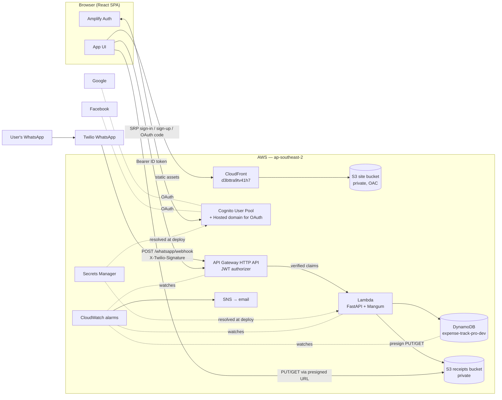
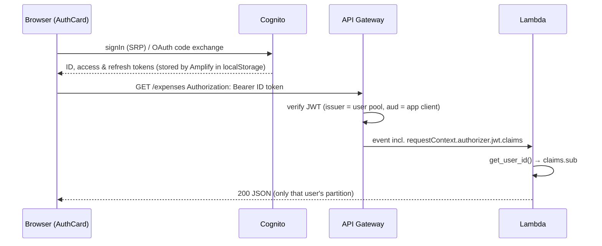
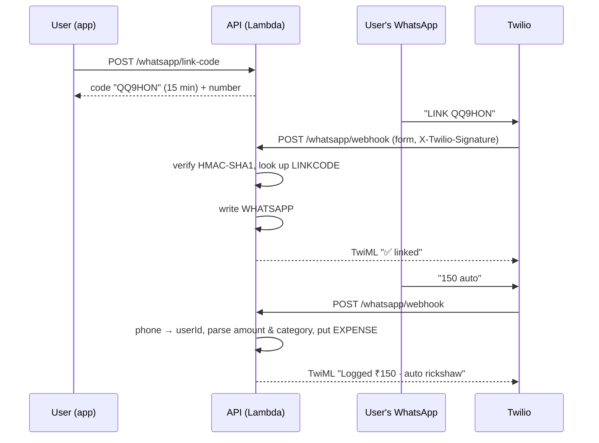

# ExpenseTrack Pro

A household expense tracker built for Indian families: log expenses (by hand, by bulk import, or by texting WhatsApp), set budgets, track savings goals, and see where the money went on a dashboard that exports to PDF, Excel, CSV and JSON.

It is a React single-page app hosted on S3 + CloudFront, talking to a FastAPI app on AWS Lambda behind API Gateway, with Cognito for sign-in and DynamoDB for storage. All infrastructure is defined in AWS CDK (Python).

| | |
|---|---|
| **Live app (dev stage)** | https://d3bttra9tv41h7.cloudfront.net |
| **API (dev stage)** | https://hbsqcepav7.execute-api.ap-southeast-2.amazonaws.com |
| **AWS Region** | `ap-southeast-2` (Sydney) — the project's only Region, see [AWS account constraints](#aws-account-constraints) |
| **Repo** | https://github.com/Harshavardhan-Dev-988/ExpenseTrackPro-Cloud |

---

## Contents

1. [Tech stack](#1-tech-stack)
2. [System architecture](#2-system-architecture)
3. [Repository layout](#3-repository-layout)
4. [AWS infrastructure (CDK stacks)](#4-aws-infrastructure-cdk-stacks)
5. [Authentication & authorization](#5-authentication--authorization)
6. [API reference](#6-api-reference)
7. [Data model (DynamoDB & S3)](#7-data-model-dynamodb--s3)
8. [WhatsApp logging (Twilio)](#8-whatsapp-logging-twilio)
9. [Frontend architecture](#9-frontend-architecture)
10. [Configuration & secrets](#10-configuration--secrets)
11. [Local development](#11-local-development)
12. [Testing](#12-testing)
13. [Deployment](#13-deployment)
14. [Monitoring & operations](#14-monitoring--operations)
15. [Troubleshooting](#15-troubleshooting)
16. [Known limitations & tech debt](#16-known-limitations--tech-debt)

---

## 1. Tech stack

### Frontend (`frontend/`)

| Concern | Choice | Notes |
|---|---|---|
| UI framework | React 19 + TypeScript 6 | Single page; sections are tab state in `App.tsx`, not routes |
| Build tool | Vite 8 | `npm run build:aws` builds for CloudFront (`--base=/`) |
| Styling | Tailwind CSS v4 | Design tokens are CSS variables in `src/index.css` ("The Ledger" palette) |
| Fonts | Fraunces (display), Karla (body), JetBrains Mono (figures) | Loaded from Google Fonts in `index.html` |
| Animation | framer-motion 12 | Page/section transitions, toasts, dialogs |
| Charts | Recharts 3, D3 7 | `LedgerLineChart` is hand-built with D3 |
| 3D "walk through" | three.js + @react-three/fiber + drei | Lazy-loaded only when opened |
| Auth client | AWS Amplify v6 (`aws-amplify/auth`) | Talks to Cognito; no Amplify backend/Gen2 |
| Dates | date-fns 4 | |
| Import / export | papaparse (CSV), xlsx (Excel), jsPDF (PDF), modern-screenshot (dashboard snapshot) | |
| Legacy local storage | idb (IndexedDB) | Only read once, by the local→cloud migration (`MigrationGate`) |

### Backend (`backend/api/`)

| Concern | Choice | Notes |
|---|---|---|
| Language / runtime | Python 3.12 on AWS Lambda (x86_64, 256 MB, 15 s timeout) | |
| Web framework | FastAPI 0.115 + Pydantic 2 | The same app runs locally under uvicorn |
| Lambda adapter | Mangum 0.19 | Translates API Gateway HTTP API events ⇄ ASGI |
| AWS SDK | boto3 | DynamoDB (resource API), S3 presigned URLs |
| Form parsing | python-multipart | Needed for Twilio's `application/x-www-form-urlencoded` webhook |

### Infrastructure (`backend/cdk/`)

| Concern | Choice |
|---|---|
| IaC | AWS CDK v2 (Python, `aws-cdk-lib==2.170.0`), CLI via `npm i -g aws-cdk` |
| Hosting | S3 (private) + CloudFront with Origin Access Control |
| API gateway | API Gateway **HTTP API** (v2) with a Cognito JWT authorizer |
| Compute | Lambda (one function, the whole FastAPI app) |
| Database | DynamoDB, single table, on-demand billing, TTL enabled |
| File storage | S3 (receipt photos), presigned URLs only |
| Identity | Cognito User Pool + Google & Facebook federation |
| Secrets | AWS Secrets Manager (resolved by CloudFormation at deploy time) |
| Monitoring | CloudWatch alarms → SNS topic → email |
| Messaging | Twilio WhatsApp (trial sender) → webhook on the API |

---

## 2. System architecture



**Request lifecycle (a normal API call):**

1. The browser gets an **ID token** from Amplify (`fetchAuthSession()`), which was issued by Cognito at sign-in.
2. `services/cloudApi.ts` calls the API with `Authorization: Bearer <idToken>`.
3. API Gateway's **JWT authorizer** verifies the token's signature, issuer (the user pool) and audience (the app client id) **before** Lambda runs. Invalid/missing token → `401` from API Gateway; the Lambda is never invoked.
4. Mangum hands the request to FastAPI. `dependencies/auth.py:get_user_id` reads the already-verified `sub` claim from the event — that is the user id every DynamoDB item is scoped to.
5. The router reads/writes the user's partition (`PK = USER#<sub>`) and returns JSON in the same camelCase shape as the frontend's TypeScript types.

**Design decisions worth knowing:**

- **One Lambda for the whole API.** Simple to deploy and keeps cold starts to one function. Routing happens inside FastAPI.
- **Auth is enforced at the gateway, not in Python.** Routes only ask "who is this?", never "is this valid?". The two unauthenticated routes (`/health`, `/whatsapp/webhook`) are explicit literal routes that take precedence over the authorized `/{proxy+}` catch-all.
- **Single-table DynamoDB.** Every query is "one partition", so there are no GSIs. See [§7](#7-data-model-dynamodb--s3).
- **Files never pass through Lambda.** Receipts go browser ⇄ S3 directly via 5-minute presigned URLs.
- **Secrets never appear in templates or git.** CDK emits `{{resolve:secretsmanager:...}}` dynamic references; CloudFormation resolves them at deploy time.

---

## 3. Repository layout

```
.
├── README.md                     ← you are here
├── CLAUDE.md                     AWS "new experience" account rules (generated by AWS Agent Toolkit)
├── Expenses_Analytics_Dashboard_Plan.md, plan-*.md   original product/roadmap notes
├── backend/
│   ├── api/                      FastAPI app — the code that runs on Lambda
│   │   ├── main.py                 app, CORS middleware, router registration
│   │   ├── lambda_handler.py       Lambda entrypoint: handler = Mangum(app)
│   │   ├── db.py                   DynamoDB helpers (get/put/delete/query by SK prefix, float→Decimal)
│   │   ├── models.py               Pydantic request/response models (camelCase, mirrors types/index.ts)
│   │   ├── dependencies/auth.py    get_user_id(): Cognito `sub` from the event, or X-Local-User-Id locally
│   │   ├── routers/                health, expenses, settings, savings, budgets, receipts, whatsapp
│   │   └── requirements.txt
│   └── cdk/                      Infrastructure as code
│       ├── app.py                  entrypoint; wires the five stacks; `stage` context
│       ├── cdk.json
│       ├── requirements.txt
│       └── stacks/
│           ├── auth_stack.py         Cognito user pool, hosted domain, Google/Facebook IdPs, app client
│           ├── data_stack.py         DynamoDB table (+ key design doc), receipts bucket
│           ├── api_stack.py          Lambda, HTTP API, authorizer, routes, env vars
│           ├── monitoring_stack.py   CloudWatch alarms + SNS email topic
│           ├── frontend_stack.py     site bucket + CloudFront + deployment of frontend/dist-aws
│           └── local_bundling.py     Docker-free Lambda dependency bundling
└── frontend/
    ├── index.html, vite.config.ts, tailwind.config.js, eslint.config.js
    ├── package.json
    └── src/
        ├── main.tsx                providers: ErrorBoundary → Toast → Confirm → AuthGate → App
        ├── App.tsx                 app shell: header, section switching, modals, all mutations
        ├── config/amplify.ts       Cognito ids, OAuth domain, redirect URLs
        ├── services/               cloudApi (HTTP client), backup, export, pdfGenerator,
        │                           dashboardSnapshot, analytics, db (legacy IndexedDB)
        ├── hooks/                  useAuth, useExpenses, useSettings, useAnalytics, useExportActions
        ├── utils/                  constants (categories, labels, palette), helpers, period, validators
        ├── types/index.ts          Expense, CategoryType (81 values), Budget, Settings, Savings*
        └── components/
            ├── auth/               SignInScreen (landing), AuthCard, HeroPreview, AuthGate, MigrationGate
            ├── layout/             AppHeader (tabs + ☰ menu / mobile drawer), nav
            ├── dashboard/          DashboardView, CategoryBreakdown, RecentActivity, CategoryExpensesModal
            ├── charts/             LedgerLineChart, CategoryPie, PaymentMethod, Weekday, Daily, MonthlyTrend
            ├── expenses/ forms/ budgets/ savings/ backup/ reports/ whatsapp/ analytics/ walkthrough/
            └── ui/                 Toast + toastContext, ConfirmDialog + confirmContext, Spinner, StatTile, CountUp
```

---

## 4. AWS infrastructure (CDK stacks)

`backend/cdk/app.py` defines five stacks per **stage** (default `dev`; set with `-c stage=prod` or `APP_STAGE=prod`). Each stage is a fully separate copy (its own user pool, table, API, site).

| Stack | Depends on | What it creates | Outputs |
|---|---|---|---|
| `ExpenseTrack-Auth-<stage>` | — | Cognito User Pool `expense-track-pro-<stage>`, hosted domain `expense-track-pro-<stage>.auth.ap-southeast-2.amazoncognito.com`, Google + Facebook identity providers, SPA app client, branded verification email | `UserPoolId`, `UserPoolClientId`, `HostedUiDomainUrl` |
| `ExpenseTrack-Data-<stage>` | — | DynamoDB table `expense-track-pro-<stage>` (PK/SK, on-demand, TTL attr `ttl`, PITR in prod only); S3 bucket `expense-track-pro-receipts-<stage>-<account>` (private, SSE-S3, CORS for the app origins) | `TableName`, `ReceiptsBucketName` |
| `ExpenseTrack-Api-<stage>` | Auth, Data | Lambda (Python 3.12, 256 MB, 15 s) with read/write grants on the table and bucket; HTTP API `expense-track-pro-<stage>` with Cognito authorizer, CORS and three routes | `ApiUrl` |
| `ExpenseTrack-Monitoring-<stage>` | Api | SNS topic `expense-track-pro-alerts-<stage>` with an email subscription; 5 CloudWatch alarms | — |
| `ExpenseTrack-Frontend-<stage>` | — | Private S3 site bucket `expense-track-pro-site-<stage>-<account>`, CloudFront distribution (OAC, HTTPS redirect, SPA fallback of 403/404 → `/index.html`), `BucketDeployment` of `frontend/dist-aws` with a `/*` invalidation | `SiteUrl`, `SiteBucketName` |

**Removal policies:** in non-prod stages the table, buckets and user pool are `DESTROY` (and buckets auto-empty), so `cdk destroy` cleans up fully. In `prod` they are `RETAIN`.

**Currently deployed (dev):**

| Resource | Value |
|---|---|
| Account | `719312763274` |
| API URL | `https://hbsqcepav7.execute-api.ap-southeast-2.amazonaws.com` |
| User pool / client | `ap-southeast-2_f6zD79Um0` / `4m6v1tcrennnmftkvvhvkbilnv` |
| Cognito domain | `https://expense-track-pro-dev.auth.ap-southeast-2.amazoncognito.com` |
| Table | `expense-track-pro-dev` |
| Receipts bucket | `expense-track-pro-receipts-dev-719312763274` |
| Site | `https://d3bttra9tv41h7.cloudfront.net` (bucket `expense-track-pro-site-dev-719312763274`) |
| Alerts topic | `expense-track-pro-alerts-dev` → `harshareddyi2u@gmail.com` |

### HTTP API routes

| Route | Methods | Authorizer | Purpose |
|---|---|---|---|
| `/{proxy+}` | GET, POST, PUT, DELETE, PATCH | Cognito JWT | Everything in the FastAPI app |
| `/health` | GET | none | Uptime check |
| `/whatsapp/webhook` | POST | none | Twilio calls it; the app verifies `X-Twilio-Signature` itself |

`OPTIONS` is deliberately *not* routed — API Gateway's built-in CORS responder answers preflights. Routing `ANY` would send preflights through the authorizer and break every cross-origin request.

**CORS:** allowed origins are `http://localhost:5173`, `http://localhost:5193` and the CloudFront URL; methods GET/POST/PUT/DELETE/OPTIONS; headers `Authorization`, `Content-Type`. The same origin list also appears in FastAPI's `CORSMiddleware` (for local uvicorn) and the receipts bucket CORS rules — keep the three in sync.

### Lambda environment variables

| Variable | Source | Used by |
|---|---|---|
| `TABLE_NAME` | Data stack | `db.py` |
| `RECEIPTS_BUCKET_NAME` | Data stack | `routers/receipts.py` |
| `STAGE` | `stage` context | `dependencies/auth.py` (local header only allowed outside `prod`) |
| `TWILIO_AUTH_TOKEN` | Secrets Manager `expense-track-pro/twilio-auth-token` (dynamic reference) | webhook signature check |
| `TWILIO_WHATSAPP_NUMBER` | constant in `api_stack.py` (`+17372508034`) | shown to users when linking |

### Docker-free Lambda bundling

`stacks/local_bundling.py` builds the Lambda package without Docker: it runs `pip install --platform manylinux2014_x86_64 --only-binary=:all: --python-version 3.12` into the asset folder and copies the API source in. This produces the same Lambda-compatible wheels a SAM build container would, on any OS. Consequence: **every dependency in `api/requirements.txt` must have a manylinux wheel** (pure-Python packages are fine).

### AWS account constraints

This project uses AWS's newer "projects" sign-up (see `CLAUDE.md`). In short: everything regional must be in **ap-southeast-2**; no Lambda@Edge, no StackSets, no cross-Region replication. If operations that used to work suddenly return `AccessDenied`, check the project's **spend limit** in AWS Settings → Billing first.

---

## 5. Authentication & authorization

### Cognito user pool (`auth_stack.py`)

| Setting | Value |
|---|---|
| Sign-in identifier | email (no separate username) |
| Self sign-up | enabled; email auto-verified with a 6-digit code |
| Password policy | ≥ 8 chars, upper + lower case, a digit (symbols optional) |
| Account recovery | email only |
| Verification email | branded HTML template (`user_verification` in `auth_stack.py`), code style; also used for password-reset codes. Sent by Cognito's default sender (**limited to 50 emails/day** — move to SES before real launch) |
| Federated IdPs | Google (scopes `openid email profile`), Facebook (scopes `public_profile email`, Graph API `v17.0`) — both map `email` and `name` |
| App client | public SPA client (no secret); auth flows `USER_SRP_AUTH` + `USER_PASSWORD_AUTH`; OAuth authorization-code grant; scopes `openid email profile`; `preventUserExistenceErrors` on |
| Callback / sign-out URLs | `http://localhost:5173/`, `http://localhost:5193/`, `https://d3bttra9tv41h7.cloudfront.net/` |

Google and Facebook client secrets live in Secrets Manager (`expense-track-pro/google-oauth-client-secret`, `expense-track-pro/facebook-app-secret`) and are injected as CloudFormation dynamic references.

### Sign-in flows in the app

All sign-in UI is in-app (`components/auth/AuthCard.tsx` on the landing page). Cognito's hosted pages are only used as the OAuth broker for Google/Facebook and are never shown.

| Flow | Amplify calls | Notes |
|---|---|---|
| Email sign-in | `signIn({ username: email, password })` | SRP — the password itself is never sent. If the account is unconfirmed, a new code is sent and the card switches to verification |
| Create account | `signUp({ username, password, options: { userAttributes: { email, name? }, autoSignIn: true } })` → `confirmSignUp` → `autoSignIn()` | Live password-rule checklist; resend with 30 s cooldown |
| Forgot password | `resetPassword` → `confirmResetPassword` → `signIn` | |
| Google / Facebook | `signInWithRedirect({ provider: 'Google' \| 'Facebook' })` | Goes to Cognito `/oauth2/authorize?identity_provider=…`, which forwards straight to the provider and redirects back with a code that Amplify exchanges |

`hooks/useAuth.ts` listens on Amplify's `Hub` (`signedIn`, `signInWithRedirect`, `signInWithRedirect_failure`, `signedOut`) and `components/auth/AuthGate.tsx` renders the landing page until there is a user. Redirect failures are shown on the sign-in card.



**Why the ID token, not the access token:** the HTTP API JWT authorizer checks `aud` against the app client id, and only Cognito's ID token carries `aud`.

**Local development auth:** when the API runs under uvicorn there is no authorizer, so `get_user_id` accepts an `X-Local-User-Id: <anything>` header instead — only when `STAGE != prod`, and only when the request did not come through API Gateway.

### One-time local → cloud migration

Before the cloud backend existed, data lived in the browser's IndexedDB (`services/db.ts`). After sign-in, `MigrationGate` checks that database once per (browser, user); if it finds data it offers to upload it, then records `etp:migrated:<userId>` in localStorage so it never asks again.

---

## 6. API reference

Base URL: the stack's `ApiUrl`. All bodies are JSON with camelCase fields. All routes except `/health` and `/whatsapp/webhook` require `Authorization: Bearer <Cognito ID token>`. Interactive docs (Swagger UI) are served at `/docs` when running locally.

| Method & path | Body → Response | Notes |
|---|---|---|
| `GET /health` | → `{"status":"ok"}` | No auth |
| **Expenses** | | |
| `GET /expenses` | → `Expense[]` | All of the caller's expenses (paginates DynamoDB internally) |
| `POST /expenses` | `ExpenseCreate` → `Expense` (201) | **The server assigns `id`, `createdAt`, `updatedAt`**; any `id` sent is ignored |
| `PUT /expenses/{id}` | `ExpenseUpdate` → `Expense` | Partial update. An omitted field is left alone; a field sent as `null` is cleared |
| `DELETE /expenses/{id}` | → 204 | 404 if not the caller's |
| **Settings** | | |
| `GET /settings` | → `Settings` | Defaults (`INR`, `DD/MM/YYYY`, `system`, `en-IN`) if never saved |
| `PUT /settings` | `Settings` → `Settings` | Upsert |
| **Budgets** (one per category) | | |
| `GET /budgets` | → `Budget[]` | |
| `PUT /budgets/{category}` | `Budget` → `Budget` | Upsert keyed by category |
| `DELETE /budgets/{category}` | → 204 | |
| **Savings** | | |
| `GET/POST /savings/entries`, `PUT/DELETE /savings/entries/{id}` | `SavingsEntryCreate`/`Update` → `SavingsEntry` | |
| `GET/POST /savings/goals`, `PUT/DELETE /savings/goals/{id}` | `SavingsGoalCreate`/`Update` → `SavingsGoal` | |
| **Receipts** | | |
| `POST /receipts/upload-url` | `{contentType}` → `{uploadUrl, key}` | `image/jpeg`, `image/png`, `image/webp`, `image/heic` only; URL valid 300 s; browser then `PUT`s the file with the same `Content-Type` |
| `GET /receipts/view-url?key=…` | → `{viewUrl}` | 403 unless the key is under the caller's own prefix; URL valid 300 s |
| `DELETE /receipts/{key}` | → 204 | Same ownership check |
| **WhatsApp** | | |
| `POST /whatsapp/link-code` | → `{code, expiresInSeconds, sandboxNumber}` | 6-char code, valid 15 min |
| `GET /whatsapp/status` | → `{linked, phoneNumber?}` | |
| `DELETE /whatsapp/link` | → 204 | Unlinks both directions |
| `POST /whatsapp/webhook` | Twilio form post → TwiML XML | No Cognito auth; 403 without a valid `X-Twilio-Signature`; 503 if the token isn't configured |

**Schemas** (`backend/api/models.py`, mirrored by `frontend/src/types/index.ts`):

```ts
Expense        { id, date, amount, category, description, paymentMethod?, tags?, receiptUrl?, createdAt, updatedAt }
ExpenseCreate  { date, amount, category, description, paymentMethod?, tags?, receiptUrl? }
Settings       { currency = "INR", dateFormat = "DD/MM/YYYY", theme = "system", locale = "en-IN" }
Budget         { category, monthlyLimit?, yearlyLimit?, budgetType = "monthly"|"yearly", alertThreshold = 80, isActive = true }
SavingsEntry   { id, date, amount, category, description, account?, interestRate?, maturityDate?, isRecurring?, tags?, createdAt, updatedAt }
SavingsGoal    { id, name, targetAmount, currentAmount, deadline?, category, priority = "low"|"medium"|"high"|"critical", isActive, createdAt }
```

- Dates are ISO-8601 strings on the wire; `cloudApi.ts` converts them to `Date` objects.
- `category` and `paymentMethod` are free strings on the API by design (the 81-value `CategoryType` union lives only in the frontend; duplicating it in Python would drift). `paymentMethod` is one of `cash | card | upi | netbanking | cheque | other`.
- `receiptUrl` holds the **S3 object key**, not a URL.
- There are no bulk endpoints. Bulk import, backup restore and "replace all" fan out to single-item calls, 5 at a time (`mapWithConcurrency` in `cloudApi.ts`), with progress callbacks.

---

## 7. Data model (DynamoDB & S3)

### DynamoDB — single table `expense-track-pro-<stage>`

| Attribute | Type | Role |
|---|---|---|
| `PK` | String | Partition key |
| `SK` | String | Sort key |
| `ttl` | Number (epoch seconds) | DynamoDB TTL — only set on WhatsApp link codes |

On-demand billing, no secondary indexes. Every access is a `GetItem` on a full key or a `Query` on one partition with `begins_with(SK, prefix)`.

| Item | PK | SK | Attributes |
|---|---|---|---|
| Expense | `USER#<sub>` | `EXPENSE#<uuid>` | `id, date, amount, category, description, paymentMethod?, tags?, receiptUrl?, createdAt, updatedAt` |
| Settings | `USER#<sub>` | `SETTINGS` | `currency, dateFormat, theme, locale` |
| Budget | `USER#<sub>` | `BUDGET#<category>` | `category, monthlyLimit?, yearlyLimit?, budgetType, alertThreshold, isActive` |
| Savings entry | `USER#<sub>` | `SAVINGS_ENTRY#<uuid>` | `id, date, amount, category, description, account?, interestRate?, maturityDate?, isRecurring?, tags?, createdAt, updatedAt` |
| Savings goal | `USER#<sub>` | `SAVINGS_GOAL#<uuid>` | `id, name, targetAmount, currentAmount, deadline?, category, priority, isActive, createdAt` |
| WhatsApp link (user → phone) | `USER#<sub>` | `WHATSAPP_LINK` | `phoneNumber` |
| WhatsApp link (phone → user) | `WHATSAPP#<+E164 number>` | `LINK` | `userId` |
| Pending link code | `LINKCODE#<CODE>` | `PENDING` | `userId, ttl` (expires after 15 min) |

Notes:
- `<sub>` is the Cognito user's immutable `sub` claim.
- Numbers are stored as DynamoDB `Number` (boto3 `Decimal`); `db.put_item` converts Python floats via a JSON round-trip.
- Everything a user owns sits in one partition, so "load my ledger" is one paginated `Query`. At personal-finance volumes (a few thousand items per user) this is well within limits; if a single user ever grew very large, a date-sortable SK (e.g. `EXPENSE#<isoDate>#<uuid>`) would allow range queries.
- The two WhatsApp link items exist so lookups work in both directions without a GSI.

### S3 — receipts bucket

- Key layout: `receipts/<sub>/<uuid>.<jpg|png|webp|heic>`.
- Block-all-public-access, SSE-S3 encryption. CORS allows `PUT`/`GET` from the app origins.
- Access is only through presigned URLs issued by the API, each scoped to the caller's prefix and valid for 5 minutes.
- Known limitation: the presigned PUT pins the `Content-Type` but doesn't verify the bytes or cap file size.

### Browser storage

| Key | Where | Purpose |
|---|---|---|
| Amplify `CognitoIdentityServiceProvider.*` | localStorage | Cognito tokens (Amplify default) |
| `etp:migrated:<userId>` | localStorage | Local→cloud migration already handled |
| `etp:dashboardRange` | localStorage | Last dashboard period (per browser convenience) |
| IndexedDB `ExpenseTrackerDB` | IndexedDB | Legacy pre-cloud data; read once by `MigrationGate` |

---

## 8. WhatsApp logging (Twilio)

Users can text an expense ("450 dinner zomato") to the app's WhatsApp number and it is recorded.



- **Signature verification:** `HMAC-SHA1(authToken, fullUrl + sorted(key+value of every form field))`, base64, compared in constant time with `X-Twilio-Signature`.
- **Parsing:** the first number (optionally prefixed `₹`/`rs`/`inr`) is the amount; the remaining text is the description; the category comes from a keyword table (`CATEGORY_KEYWORDS` in `routers/whatsapp.py`, e.g. auto/rickshaw → `auto_rickshaw`, petrol → `fuel`, dinner → `dine_out`), falling back to `other`. Messages without a number get a help reply instead.
- **Twilio setup:** the account uses Twilio's free **WhatsApp trial sender `+17372508034`**. In the Twilio console, set the sender's "When a message comes in" webhook to `POST <ApiUrl>/whatsapp/webhook`. Each phone must first join the trial sender (QR code or join message shown in the console), and trial accounts can only exchange messages with up to 5 verified numbers. Moving to a production WhatsApp sender needs Meta business verification and has per-message costs.
- **Token:** the real Twilio Auth Token must be stored in `expense-track-pro/twilio-auth-token` (see [§10](#10-configuration--secrets)). **At the time of writing it still holds a placeholder**, so live webhook calls are rejected until it is set and the Api stack redeployed.

---

## 9. Frontend architecture

### Boot sequence

```
main.tsx
└─ ErrorBoundary
   └─ ToastProvider            (components/ui/Toast.tsx)        app-wide status toasts
      └─ ConfirmProvider       (components/ui/ConfirmDialog.tsx) promise-based confirm dialogs
         └─ AuthGate           checking session → SignInScreen (landing) | ↓
            └─ MigrationGate   one-time IndexedDB → cloud offer
               └─ App          header, sections, modals
```

`config/amplify.ts` is imported first and configures Amplify with the user pool, app client and OAuth settings.

### App shell (`App.tsx`)

- Holds all section state (`dashboard | expenses | budgets | savings | analytics`) — there is no router; CloudFront's 403/404 → `index.html` fallback keeps deep links safe if one is added later.
- Owns every mutation and the user feedback for it: add/edit (toast), delete (`useConfirm` dialog → API → toast), bulk import (progress toast), backup restore, exports, theme, sign-out.
- `AppHeader` shows the section tabs and **Add expense**; everything else (import, backup & restore, export submenu, WhatsApp, dark mode, sign out) is in the ☰ menu. On phones the menu is a slide-in drawer that also contains the sections.

### Data hooks

| Hook | Responsibility |
|---|---|
| `useAuth` | Current user, Hub events, redirect errors, `signOut` |
| `useExpenses` | Loads all expenses once (`loading` = first load only); add/update/delete update local state after the API call succeeds (using the **server-assigned id** on create); `addExpenses` (bulk) re-fetches; mutation errors are thrown to callers, never turned into the full-screen error |
| `useSettings` | Loads settings; `updateSettings` is optimistic (applies dark mode instantly, rolls back on failure) |
| `useAnalytics` | Category stats, totals, trends for a given expense list |
| `useExportActions` | CSV/Excel/JSON/summary exports with toasts |

### Services

| Service | Responsibility |
|---|---|
| `cloudApi.ts` | The only HTTP client. Adds the ID token, converts dates, sends explicit `null`s on update, fan-out helpers with progress |
| `backup.ts` | Backup file format `{ version: "1.0", exportDate, data: { expenses, budgets, settings }, metadata }`, validation, merge/replace import with progress |
| `export.ts` | CSV / Excel / JSON / summary files |
| `dashboardSnapshot.ts` | "Dashboard snapshot" PDF: renders the live dashboard DOM with modern-screenshot, inlines the Google web fonts as data URLs, and paginates on `data-snapshot-block` boundaries (or one long page) |
| `pdfGenerator.ts` | "Detailed report" PDF drawn natively with jsPDF (summary, trend, categories, payment methods, budgets, largest expenses, optional full transaction list). Uses "Rs" because jsPDF's built-in fonts lack the ₹ glyph |
| `analytics.ts`, `advancedAnalytics.ts` | Stats, trends, anomaly detection for the Reports section |
| `db.ts` | Legacy IndexedDB store (migration source only) |

### Period logic (`utils/period.ts`)

Shared by the dashboard and the PDF report so they always agree:

- `resolvePeriod` turns the dashboard range (`today | month | year | all | custom`) into concrete dates and labels.
- `previousPeriod` gives the comparison window — like-for-like for a running month/year (Oct 1–9 vs Sep 1–9).
- `bucketSeries` groups the trend by day (≤ 62 days), week (≤ 400 days) or month.
- `budgetWindow` + `computeBudgetStatus` scale budgets to the period (a ₹13,000/month budget over a quarter is ₹39,000; "today" is judged against the current month).

### Design system

"The Ledger": paper background, ink text, **pine** for actions, **brass** for money/highlights, **ember** only for over-budget/destructive. Tokens are RGB CSS variables in `src/index.css` (light on `:root`, lifted values on `.dark`) exposed to Tailwind in `tailwind.config.js`, so `bg-pine/10` etc. work in both themes. Dark mode is a `dark` class on `<html>`, driven by the user's saved setting (or the OS when set to `system`). The landing page uses its own fixed dark palette.

### Categories

`types/index.ts` defines 81 `CategoryType` values in 13 groups (`utils/constants.ts` → `CATEGORY_GROUPS`, `CATEGORY_LABELS`, `CATEGORY_GROUP_PALETTE`), tailored to Indian households (UPI, Blinkit/Zepto/Zomato, maid/cook/driver, festivals, school fees, agriculture). `agri_seeds_fertilizers` is a legacy combined category kept only so old data still imports.

---

## 10. Configuration & secrets

### Secrets Manager (create once per account, before the first deploy)

| Secret name | Contents | Used by |
|---|---|---|
| `expense-track-pro/google-oauth-client-secret` | Google OAuth client secret (plain string) | Auth stack (Google IdP) |
| `expense-track-pro/facebook-app-secret` | Facebook app secret (plain string) | Auth stack (Facebook IdP) |
| `expense-track-pro/twilio-auth-token` | Twilio Auth Token (plain string) | Api stack (Lambda env) |

```bash
aws secretsmanager create-secret --region ap-southeast-2 \
  --name expense-track-pro/twilio-auth-token --secret-string '<value>'
# to rotate later:
aws secretsmanager put-secret-value --region ap-southeast-2 \
  --secret-id expense-track-pro/twilio-auth-token --secret-string '<new value>'
```

Secrets are read **at deploy time**, so after changing one, redeploy the stack that uses it (`Auth` for Google/Facebook, `Api` for Twilio).

### Non-secret configuration (hard-coded — update together if anything is recreated)

| Value | Where |
|---|---|
| Google client id | `backend/cdk/stacks/auth_stack.py` → `GOOGLE_OAUTH_CLIENT_ID` |
| Facebook app id (`1413826136840708`) and Graph API version | `auth_stack.py` → `FACEBOOK_APP_ID`, `api_version` |
| Twilio WhatsApp number | `api_stack.py` → `TWILIO_WHATSAPP_NUMBER` (and the fallback in `routers/whatsapp.py`) |
| Alert email | `app.py` (`ALERT_EMAIL` env var overrides) |
| User pool id, client id, OAuth domain, redirect URLs | `frontend/src/config/amplify.ts` |
| API base URL | `frontend/src/services/cloudApi.ts` → `API_BASE_URL` |
| Allowed origins / callback URLs | `auth_stack.py` (callbacks), `api_stack.py` (HTTP API CORS), `api/main.py` (FastAPI CORS), `data_stack.py` (receipts bucket CORS) |

If you add a new origin (a custom domain, another dev port), add it to **all four** origin lists and to `amplify.ts`'s redirect URLs.

### External consoles

| Provider | Setting |
|---|---|
| Google Cloud Console → OAuth client | Authorized redirect URI: `https://expense-track-pro-dev.auth.ap-southeast-2.amazoncognito.com/oauth2/idpresponse` |
| Meta for Developers → app `1413826136840708` | Facebook Login → Valid OAuth Redirect URI: same `/oauth2/idpresponse` URL. **Use cases → Facebook Login → Permissions: add `email`** (otherwise Facebook rejects the login with "Invalid Scopes: email") |
| Twilio console → WhatsApp trial sender | "When a message comes in": `POST <ApiUrl>/whatsapp/webhook` |

---

## 11. Local development

### Prerequisites

- Node.js 20+ (22 used in development) and npm
- Python 3.12+
- AWS CLI v2 — only needed for deploying or talking to real AWS
- Optional: Docker (for DynamoDB Local)

### A. Frontend against the deployed dev backend (most common)

The deployed API and Cognito already allow `http://localhost:5173`, so the frontend can run locally with no backend setup.

```bash
cd frontend
npm install
npm run dev:aws        # http://localhost:5173/  (root path — matches the Cognito callback URLs)
```

- Use `dev:aws`, not `dev`: plain `npm run dev` serves under `/ExpenseTrack-Pro/` (the old GitHub Pages base path), and a Google/Facebook redirect back to `http://localhost:5173/` would then miss the app. Email/password sign-in works with either.
- You sign in with a real account and read/write the real **dev** data.
- Hot reload is instant; the browser console shows API errors.

### B. Backend API locally (no AWS account needed)

Run the FastAPI app with uvicorn against a local DynamoDB. boto3 honours `AWS_ENDPOINT_URL_DYNAMODB`, so no code changes are needed.

```bash
# 1) A local DynamoDB — either:
docker run -d -p 8001:8000 amazon/dynamodb-local
#    …or, without Docker:
#    pip install "moto[server]" && moto_server -p 8001

# 2) Fake credentials + point boto3 at it (any values work locally)
export AWS_ACCESS_KEY_ID=local AWS_SECRET_ACCESS_KEY=local AWS_DEFAULT_REGION=ap-southeast-2
export AWS_ENDPOINT_URL_DYNAMODB=http://localhost:8001

# 3) Create the table (same key schema as the CDK table)
aws dynamodb create-table --endpoint-url http://localhost:8001 \
  --table-name expense-track-pro-local \
  --attribute-definitions AttributeName=PK,AttributeType=S AttributeName=SK,AttributeType=S \
  --key-schema AttributeName=PK,KeyType=HASH AttributeName=SK,KeyType=RANGE \
  --billing-mode PAY_PER_REQUEST

# 4) Run the API
cd backend/api
python3 -m venv .venv && source .venv/bin/activate
pip install -r requirements.txt uvicorn
TABLE_NAME=expense-track-pro-local STAGE=dev uvicorn main:app --reload --port 8000
```

Then call it with the local stand-in for a signed-in user:

```bash
curl localhost:8000/health
curl -H "X-Local-User-Id: test-user" localhost:8000/expenses
curl -X POST -H "X-Local-User-Id: test-user" -H "Content-Type: application/json" \
  -d '{"date":"2026-10-09T00:00:00Z","amount":250,"category":"grocery","description":"Weekly groceries"}' \
  localhost:8000/expenses
curl -X PUT -H "X-Local-User-Id: test-user" -H "Content-Type: application/json" \
  -d '{"category":"grocery","monthlyLimit":13000,"budgetType":"monthly","alertThreshold":80,"isActive":true}' \
  localhost:8000/budgets/grocery
```

Swagger UI: http://localhost:8000/docs.

Limitations of the local API: receipts need a real S3 bucket (set `RECEIPTS_BUCKET_NAME` and real credentials, or skip them); the WhatsApp webhook needs `TWILIO_AUTH_TOKEN` and a correctly signed request.

> The frontend can't be pointed at the local API as-is: it always sends a Cognito Bearer token to the hard-coded `API_BASE_URL`, and the local API expects `X-Local-User-Id`. Use option A for UI work and option B for API work.

### C. Seed data

`frontend/sample-backup-2-years.json` is a realistic two-year backup for a fictional Pune family (≈1,560 expenses across 80 categories, 18 budgets, Oct 2024 – Oct 2026). Import it through **☰ → Backup & restore → Select backup file**. Use "Merge" to add to existing data or "Replace" to start clean. CSV/Excel/JSON samples for **☰ → Import expenses** are in `frontend/` (`sample-expenses*.csv`, `sample-expenses.json`).

---

## 12. Testing

There is **no automated test suite yet**. Current checks:

| Check | Command | Status |
|---|---|---|
| Production build | `cd frontend && npm run build:aws` | Must pass (this is what deploys) |
| Type check | `cd frontend && npx tsc -b` | ~24 **pre-existing** errors in analytics/export/legacy files; new code should add none. `npm run build` (which runs `tsc -b` first) therefore fails today — deploys use `build:aws` |
| Lint | `cd frontend && npm run lint` | ~70 pre-existing errors (mostly `react-hooks/set-state-in-effect`, `no-explicit-any` in older files) |
| CDK synth | `cd backend/cdk && cdk synth` | Must pass; requires `frontend/dist-aws` to exist (build the frontend first, or create an empty folder for synth-only checks) |
| CDK diff | `cdk diff <stack>` | Review before every deploy — look for unexpected **replacements** |
| API smoke (local) | the curl commands in [§11B](#b-backend-api-locally-no-aws-account-needed) | |
| API smoke (deployed) | `curl <ApiUrl>/health` → `{"status":"ok"}`; `curl <ApiUrl>/expenses` → `401` | |

### Manual test checklist (before a release)

- Landing page renders; email sign-up → code email arrives → verify → lands in the app; sign out; sign in; forgot password.
- Google and Facebook sign-in round-trip.
- Add, edit, delete an expense (confirm dialog, toasts); edit an expense right after adding it.
- Dashboard periods (Today / Month with ‹ › / Year / All time / Custom); budget strip; category drill-down.
- PDF → Dashboard snapshot (A4 and one long page) and Detailed report.
- Backup download; restore in Merge and Replace mode (progress shown); bulk import CSV.
- Receipt upload and view.
- WhatsApp: generate link code, `LINK <code>`, then `150 auto` → appears after refresh.
- Repeat key screens on a phone width and in dark mode.

### Suggested next steps

- **Backend:** pytest + FastAPI `TestClient` with `moto` (`@mock_aws`) for DynamoDB/S3 — `db.py` and `receipts.py` create clients lazily precisely so tests can mock them. Unit-test `_parse_expense_message` and `_verify_twilio_signature` (Twilio publishes test vectors).
- **Frontend:** Vitest for `utils/period.ts`, `services/backup.ts` validation and `pdfGenerator` stats; Playwright end-to-end with Amplify stubbed and the API mocked via route interception.
- **CI:** GitHub Actions running build, lint, tests and `cdk synth` on every PR.

---

## 13. Deployment

### First-time setup (new AWS account or new stage)

1. **AWS access.** Either sign in with `aws login --region ap-southeast-2 --profile expense-track-pro` (AWS "new experience" projects), or create an IAM user with an access key whose policy only allows `sts:AssumeRole` on `arn:aws:iam::<account>:role/cdk-hnb659fds-*` plus `secretsmanager:*Secret*` on `expense-track-pro/*` (the minimal CDK-deployer pattern). Verify with `aws sts get-caller-identity`.
2. **Install tools.**
   ```bash
   npm install -g aws-cdk
   cd backend/cdk && python3 -m venv .venv && source .venv/bin/activate && pip install -r requirements.txt
   ```
3. **Bootstrap CDK** (once per account/Region): `cdk bootstrap aws://<account>/ap-southeast-2`.
4. **Create the three secrets** ([§10](#10-configuration--secrets)). The Auth and Api stacks fail to deploy if they're missing.
5. **Build the frontend** (the Frontend stack uploads `frontend/dist-aws`):
   ```bash
   cd frontend && npm ci && npm run build:aws
   ```
6. **Deploy everything:**
   ```bash
   cd backend/cdk
   export CDK_DEFAULT_ACCOUNT=<account> CDK_DEFAULT_REGION=ap-southeast-2
   cdk deploy --all                     # dev stage
   # cdk deploy --all -c stage=prod     # a separate prod copy
   ```
7. **Wire up the outputs.** For a *new* stage/pool, update `frontend/src/config/amplify.ts` (pool id, client id, domain), `services/cloudApi.ts` (`API_BASE_URL`) and the origin lists if the CloudFront URL changed, then rebuild and redeploy the Frontend stack.
8. **External consoles:** add the Cognito `/oauth2/idpresponse` URL to Google and Facebook, add the `email` permission in Facebook, and set the Twilio webhook ([§10](#10-configuration--secrets)).
9. **Confirm the SNS subscription** from the email AWS sends to the alert address, or alarms won't be delivered.

### Routine deploys

| Changed | Run |
|---|---|
| Frontend code | `cd frontend && npm run build:aws` → `cd ../backend/cdk && cdk deploy ExpenseTrack-Frontend-dev --exclusively` (invalidates CloudFront automatically) |
| API code or dependencies | `cdk deploy ExpenseTrack-Api-dev --exclusively` |
| Cognito / IdP settings | `cdk deploy ExpenseTrack-Auth-dev --exclusively` |
| Table / bucket settings | `cdk deploy ExpenseTrack-Data-dev --exclusively` |
| Alarms | `cdk deploy ExpenseTrack-Monitoring-dev --exclusively` |
| A secret's value | `put-secret-value`, then redeploy the stack that uses it |

Always run `cdk diff <stack>` first. `--exclusively` stops CDK from also redeploying dependency stacks.

> **Be careful with Auth and Data stack changes.** Some property changes *replace* the resource: a new user pool means every user must sign up again, and a replaced table loses its data in non-prod (it's `DESTROY`). `cdk diff` marks these as `[-]/[+]` with "replace" — stop and rethink if you see one.

### Rollback

Every deploy is a CloudFormation change set; if a stack update fails, CloudFormation rolls it back automatically. To roll back code that deployed successfully, check out the previous commit, rebuild, and redeploy the affected stack.

### Tear down a stage

`cdk destroy --all -c stage=<stage>` (non-prod resources are set to delete fully). Secrets are not part of any stack and must be deleted separately if no longer needed.

---

## 14. Monitoring & operations

### Alarms (`monitoring_stack.py`) → SNS `expense-track-pro-alerts-<stage>` → email

| Alarm | Metric | Fires when |
|---|---|---|
| `LambdaErrorsAlarm` | Lambda `Errors` (Sum, 5 min) | ≥ 1 |
| `LambdaThrottlesAlarm` | Lambda `Throttles` (Sum, 5 min) | ≥ 1 |
| `ApiServerErrorAlarm` | HTTP API `5xx` (Sum, 5 min) | ≥ 1 |
| `ApiHighLatencyAlarm` | HTTP API `Latency` (p99, 5 min) | ≥ 3000 ms for 2 periods |
| `TableThrottledRequestsAlarm` | DynamoDB throttled requests (Sum, 5 min) | ≥ 1 |

Missing data is treated as not breaching, so quiet periods don't alarm.

### Logs

```bash
# Lambda logs (the function name is printed by `cdk deploy`, or find it in the Lambda console)
aws logs tail /aws/lambda/<ApiFunctionName> --follow --region ap-southeast-2
```

FastAPI tracebacks for any 500 appear here. API Gateway access logging is not enabled.

### Cost notes

Everything is serverless and pay-per-use (Lambda, HTTP API, on-demand DynamoDB, S3, CloudFront), so an idle stage costs close to nothing. Watch: Secrets Manager (~$0.40/secret/month), Cognito MAUs beyond the free tier, Twilio messages once off the trial, and the Cognito default email limit (50/day).

---

## 15. Troubleshooting

| Symptom | Cause / fix |
|---|---|
| Every API call returns `401` | No/expired token, or a token from a different user pool/client. Sign out and in. Confirm `amplify.ts` matches the deployed `UserPoolId`/`UserPoolClientId` |
| Browser console shows CORS errors | The page's origin isn't in the HTTP API CORS list (and FastAPI/bucket lists). See [§10](#10-configuration--secrets) |
| Google/Facebook redirect ends on a blank or "did you mean /ExpenseTrack-Pro/" page locally | Use `npm run dev:aws` (root base path) |
| Cognito `redirect_mismatch` | The exact URL (scheme, port, trailing slash) isn't in the app client's callback list |
| Facebook: "Invalid Scopes: email" | Add the `email` permission to the Facebook Login use case in the Meta developer console |
| Auth stack deploy: "not a valid value for apiVersion" | Cognito only accepts Graph API versions on its own allowlist, which lags Facebook's; `v17.0` works, `v23.0`/`v25.0` were rejected |
| Auth/Api deploy fails resolving `{{resolve:secretsmanager:…}}` | The secret doesn't exist in this account/Region — create it ([§10](#10-configuration--secrets)) |
| `cdk synth` fails: "Cannot find asset … frontend/dist-aws" | Build the frontend first (`npm run build:aws`) |
| Sign-up code emails stop arriving | Cognito's default sender is capped at 50 emails/day — wait, or configure SES |
| WhatsApp replies stop / webhook returns 403 | Twilio Auth Token in Secrets Manager is wrong or a placeholder, or the webhook URL in Twilio differs from the one being signed (it must be exactly `<ApiUrl>/whatsapp/webhook`) |
| WhatsApp webhook returns 503 | `TWILIO_AUTH_TOKEN` isn't set on the Lambda — create the secret and redeploy the Api stack |
| Sudden `AccessDenied` on things that worked before | Check the AWS project's spend limit in AWS Settings → Billing |
| Lambda fails with a `form` parsing assertion | `python-multipart` missing from `api/requirements.txt` |
| A PDF snapshot shows different fonts/wrapping | Fonts couldn't be fetched from Google Fonts for embedding (network/CSP); the export still works with fallback fonts |

---

## 16. Known limitations & tech debt

- No automated tests or CI (see [§12](#12-testing)).
- Pre-existing TypeScript and ESLint errors in older frontend files; `npm run build` fails because of them, `build:aws` does not type-check.
- Frontend config (pool ids, API URL) is hard-coded rather than injected per stage via `import.meta.env`.
- Cognito uses the default email sender (50 emails/day); move to SES for production.
- Tokens live in localStorage (Amplify default). Consider cookie storage, shorter token lifetimes, and refresh-token rotation for a production launch.
- No GSIs or date-sorted keys: loading a user's data is a full-partition query (fine at current scale).
- Receipt uploads aren't size-limited or content-verified after upload.
- WhatsApp runs on Twilio's trial sender (≤ 5 verified numbers) and the real Twilio Auth Token is not yet stored.
- No custom domain; the site uses the CloudFront default domain.
- The old GitHub Pages deploy scripts (`npm run deploy`, `vite.config.ts` base `/ExpenseTrack-Pro/`) remain but are no longer the primary hosting.
